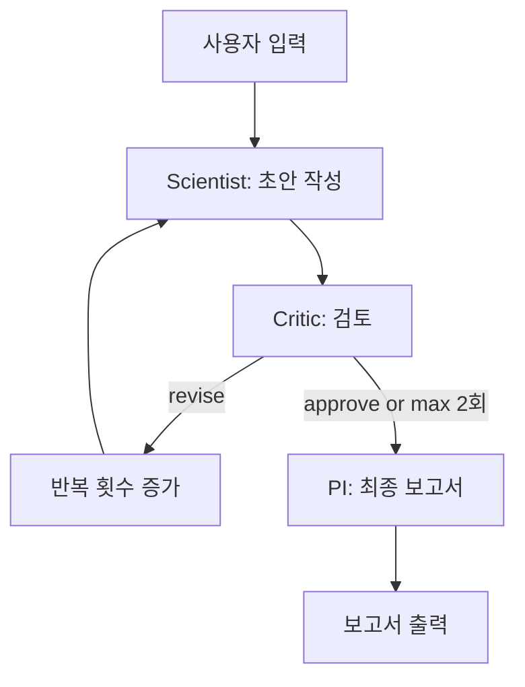

# 🧬 Virtual Lab for NGT Safety Framework (MVP)

유전자편집식품(NGT) 표준 안전성 평가 프레임워크를 도출하는 AI 에이전트 시스템

## 📋 프로젝트 개요

**목표**: NGT 카테고리 전체에 적용 가능한 표준 안전성 평가 프레임워크를 AI 에이전트 시스템으로 도출

**핵심 아키텍처**: PI + Critic + Scientist → LangGraph Critique Loop

- **Scientist Agent** (GPT-4o-mini): 위험 요소 초안 작성
- **Critic Agent** (GPT-4o): 과학적 타당성 및 범용성 검증
- **PI Agent** (GPT-4o): 최종 보고서 생성

## 🏗️ 기술 스택

### Backend
- **FastAPI**: REST API 서버
- **LangGraph**: AI 에이전트 오케스트레이션
- **LangChain + OpenAI**: GPT-4o / GPT-4o-mini

### Frontend
- **Streamlit**: 2-Column UI (Chat + Report Viewer)

### Data
- **Context Injection**: 하드코딩된 규제 가이드라인 텍스트 (Codex, FDA, EU)
- No Database, No RAG

## 🚀 빠른 시작

### 1. 환경 설정

```bash
# 저장소 클론
git clone https://github.com/baesisi3648/pjt-virtual_lab.git
cd pjt-virtual_lab

# 가상 환경 생성 (권장)
python -m venv venv
source venv/bin/activate  # Windows: venv\Scripts\activate

# 의존성 설치
pip install -r requirements.txt

# 환경 변수 설정
cp .env.example .env
# .env 파일을 열어 OPENAI_API_KEY를 입력하세요
```

### 2. 서버 실행

**터미널 1 - FastAPI 서버**
```bash
uvicorn server:app --reload --port 8000
```

**터미널 2 - Streamlit 앱**
```bash
streamlit run app.py
```

### 3. 브라우저 접속

- **Streamlit UI**: http://localhost:8501
- **FastAPI Docs**: http://localhost:8000/docs

## 📁 프로젝트 구조

```
pjt-virtual_lab/
├── agents/                 # AI 에이전트 로직
│   ├── scientist.py       # Scientist Agent (GPT-4o-mini)
│   ├── critic.py          # Critic Agent (GPT-4o)
│   └── pi.py              # PI Agent (GPT-4o)
├── workflow/              # LangGraph 워크플로우
│   ├── state.py           # AgentState, CritiqueResult
│   └── graph.py           # StateGraph with conditional edges
├── data/
│   └── guidelines.py      # 규제 가이드라인 텍스트 (Codex, FDA, EU)
├── utils/
│   └── llm.py             # OpenAI 모델 초기화
├── tests/                 # 테스트 (49/50 통과, 98%)
│   ├── test_agents.py     # 에이전트 단위 테스트
│   ├── test_workflow.py   # LangGraph 워크플로우 테스트
│   ├── test_server.py     # FastAPI 엔드포인트 테스트
│   └── test_e2e.py        # E2E 통합 테스트
├── server.py              # FastAPI 서버
├── app.py                 # Streamlit UI
├── requirements.txt       # Python 의존성
├── .env.example           # 환경 변수 템플릿
└── TASKS.md               # 개발 태스크 목록 (13개 완료)
```

## 🔄 워크플로우 흐름



### Critique Loop 규칙

- **최대 2회 반복**: Critic이 계속 `revise`를 반환해도 2회 후 강제 종료
- **조건부 분기**: `should_continue()` 함수가 `approve` 또는 반복 횟수에 따라 결정

## 🧪 테스트

```bash
# 전체 테스트 실행
pytest tests/ -v

# 커버리지 포함
pytest tests/ --cov=. --cov-report=html

# 특정 테스트만
pytest tests/test_e2e.py -v
```

### 테스트 결과

```
총 테스트: 50개
통과: 49개 (98%)
실패: 1개 (환경 변수 모킹 이슈)
커버리지: 97%
```

## 📊 API 엔드포인트

### POST /api/research

연구 워크플로우 실행

**Request:**
```json
{
  "topic": "유전자편집식품(NGT) 표준 안전성 평가",
  "constraints": "기존 GMO 대비 합리적 완화"
}
```

**Response:**
```json
{
  "report": "# 최종 보고서\n## 1. 개요...",
  "messages": [
    {"role": "scientist", "content": "..."},
    {"role": "critic", "content": "..."},
    {"role": "pi", "content": "..."}
  ],
  "iterations": 0
}
```

### GET /health

헬스체크

**Response:**
```json
{
  "status": "ok"
}
```

## 🎨 UI 구성

### 왼쪽 패널: 연구 설정 + 회의 로그
- 연구 주제 입력 폼
- 제약 조건 입력 (선택)
- 워크플로우 실행 버튼
- 에이전트별 회의 로그 (👨‍🔬 🕵️ 🎓)

### 오른쪽 패널: 최종 보고서
- Markdown 렌더링
- 보고서 다운로드 버튼 (.md 파일)

## 📝 주요 기능

### 1. 규제 가이드라인 컨텍스트 주입

4개의 텍스트 에셋을 System Prompt에 주입:
- `RESEARCH_OBJECTIVE`: 연구 목표 정의서
- `CODEX_PRINCIPLES`: Codex Alimentarius 4대 원칙
- `REGULATORY_TRENDS`: FDA/EU 규제 동향
- `CRITIQUE_RUBRIC`: 비평 기준표 (3개 항목, 1-5점)

### 2. 과학적 검증 루프

Critic Agent가 다음 기준으로 검증:
1. **과학적 근거** (1-5점): 주장의 뒷받침 정도
2. **범용성** (1-5점): 카테고리 전체 적용 가능성
3. **과도한 규제 여부** (1-5점): 불필요한 자료 요구 없는지

**승인 조건**: 모든 항목 3점 이상

### 3. 실시간 회의 로그

각 에이전트의 발언을 실시간으로 표시:
- Scientist의 초안 작성 내용
- Critic의 승인/수정 요청 및 피드백
- PI의 최종 보고서 생성 안내

## 💰 비용

OpenAI API 사용료:
- **GPT-4o**: $2.50 / 1M input tokens, $10 / 1M output tokens
- **GPT-4o-mini**: $0.15 / 1M input tokens, $0.60 / 1M output tokens

**예상 비용**: 워크플로우 1회 실행당 약 **$0.05-0.10**

## 🔒 보안

- `.env` 파일은 Git에 커밋되지 않음 (`.gitignore` 포함)
- API 키는 환경 변수로만 로드
- CORS 설정으로 cross-origin 요청 제어
- Pydantic v2 스키마로 입력 검증

## 🛠️ 개발

### 개발 모드 실행

```bash
# FastAPI 핫 리로드
uvicorn server:app --reload --port 8000

# Streamlit 핫 리로드 (자동)
streamlit run app.py
```

### 코드 품질

- **TAG System**: 모든 파일에 `@TASK`, `@SPEC`, `@TEST` 주석
- **TDD**: Phase 1+ 태스크는 테스트 우선 작성
- **Type Hints**: Python 타입 힌트 사용
- **Defense-in-Depth**: 3단계 보안 검증

## 📚 참고 문서

- [TASKS.md](./TASKS.md): 개발 태스크 목록 (13개 완료)
- [virtual_lab_mvp.md](./virtual_lab_mvp.md): MVP 기획안
- [virtual_lab_script.md](./virtual_lab_script.md): 시나리오 스크립트
- [CLAUDE.md](./CLAUDE.md): 프로젝트 메모

## 🤝 기여

이 프로젝트는 MVP(Minimum Viable Product)입니다.
추가 기능 제안이나 버그 리포트는 Issue를 통해 제출해주세요.

## 📄 라이선스

MIT License

---

**Co-Authored-By**: Claude Opus 4.6 <noreply@anthropic.com>

**Built with**: FastAPI, LangGraph, Streamlit, OpenAI API
