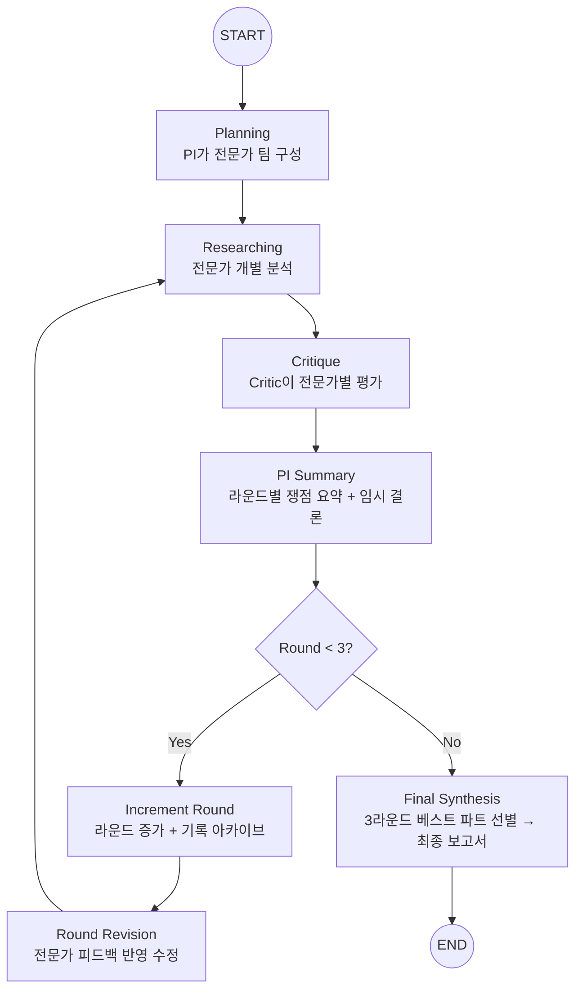

# Virtual Lab for NGT Safety Framework

유전자편집식품(NGT) 표준 안전성 평가 프레임워크를 도출하는 AI 에이전트 시스템

## 프로젝트 개요

**목표**: NGT 카테고리 전체에 적용 가능한 표준 안전성 평가 프레임워크를 AI 에이전트 팀 회의 시스템으로 도출

**핵심 아키텍처**: 3라운드 팀 회의 (Specialists + Critic + PI 전원 참여)

- **PI Agent** (GPT-5): 전문가 팀 구성, 라운드별 요약, 최종 보고서 작성
- **Specialist Agents** (GPT-5): PI가 동적으로 구성한 전문가 팀이 RAG + 웹 검색으로 개별 분석
- **Critic Agent** (GPT-5): 전문가별 과학적 타당성 검증 및 개선 피드백

## 기술 스택

| 구분 | 기술 |
|------|------|
| Backend | FastAPI + LangGraph + httpx (OpenAI API 직접 호출) |
| Frontend | Next.js 16 + React 19 + Tailwind CSS 4 |
| LLM | GPT-5 (전 에이전트) |
| Vector DB | Pinecone (규제 문서 316개) |
| Web Search | Tavily API |
| Database | SQLite (MVP) |

## 워크플로우



### 3라운드 팀 회의 흐름

| 라운드 | 실행 노드 | 설명 |
|--------|-----------|------|
| **R1** | researching → critique → pi_summary | 전문가 초기 분석 + 비평 + 요약 |
| **R2** | round_revision → critique → pi_summary | 피드백 반영 수정 + 재비평 + 요약 |
| **R3** | round_revision → critique → pi_summary → final_synthesis | 최종 수정 + 비평 + 보고서 합성 |

- LLM 호출 횟수 (전문가 3명 기준): **17회**
- 모든 라운드 내용이 프론트엔드에 **누적 표시**
- 최종 보고서는 3라운드 전체에서 **베스트 파트를 선별**하여 작성

## 빠른 시작

### 1. 환경 설정

```bash
git clone https://github.com/baesisi3648/pjt-virtual_lab.git
cd pjt-virtual_lab

python -m venv venv
source venv/bin/activate  # Windows: venv\Scripts\activate

pip install -r requirements.txt

# .env 파일에 다음 키 설정:
# OPENAI_API_KEY=sk-...
# TAVILY_API_KEY=tvly-...
# PINECONE_API_KEY=pcsk_...
# PINECONE_HOST=https://...
```

### 2. 서버 실행

```bash
# 백엔드 (권장)
./restart_server.bat

# 또는 수동:
python -B -m uvicorn server:app --host 0.0.0.0 --port 8000 --reload

# 프론트엔드 (새 터미널)
cd frontend
npm install  # 최초 1회
npm run dev
```

### 3. 접속

- **Next.js UI**: http://localhost:3000
- **FastAPI Docs**: http://localhost:8000/docs

## 프로젝트 구조

```
pjt-virtual_lab/
├── agents/                 # AI 에이전트
│   ├── scientist.py        # Specialist Agent (GPT-5) - 분석 + 수정
│   ├── critic.py           # Critic Agent (GPT-5) - 전문가별 평가
│   ├── pi.py               # PI Agent (GPT-5) - 팀구성 + 요약 + 최종보고서
│   └── factory.py          # 동적 전문가 생성 (RAG/웹검색 도구 바인딩)
├── workflow/               # LangGraph 워크플로우
│   ├── state.py            # AgentState, CritiqueResult (3라운드 상태)
│   └── graph.py            # 3라운드 팀 회의 StateGraph
├── utils/
│   └── llm.py              # OpenAI API 직접 호출 (httpx, GPT-5 호환)
├── tools/                  # LangChain Tools
│   ├── rag_search.py       # Pinecone RAG 검색
│   └── web_search.py       # Tavily 웹 검색
├── rag/                    # RAG 시스템
│   ├── pinecone_client.py  # Pinecone 클라이언트
│   ├── embeddings.py       # OpenAI embeddings
│   └── pdf_processor.py    # PDF 청킹
├── frontend/               # Next.js 16 프론트엔드
│   └── src/
│       ├── app/            # App Router (메인 페이지, 타임라인)
│       └── components/     # ProcessTimeline (SSE), ReportEditor
├── server.py               # FastAPI 서버 (REST + SSE 스트리밍)
├── config.py               # 설정
├── restart_server.bat      # 서버 재시작 (캐시 삭제 포함)
├── docs/
│   └── workflow-diagram.mmd # 워크플로우 Mermaid 다이어그램
└── tests/                  # pytest 테스트
```

## 주요 기능

### 1. 3라운드 팀 회의 시스템
- PI가 연구 주제에 맞는 전문가 팀을 **동적으로 구성**
- 모든 에이전트가 3라운드에 걸쳐 **반복 토론**
- Critic이 전문가별로 근거 적절성, 논리적 비약, 대안적 해석을 평가
- 라운드별 회의록이 `meeting_history`에 아카이브

### 2. Live Process Timeline (SSE)
- 에이전트별 실시간 활동 모니터링
- 라운드 구분선 + 전문가별 점수/피드백 패널
- 3라운드 전체 내용 누적 표시

### 3. RAG Search (Pinecone)
- 316개 규제 문서 벡터 검색
- OpenAI text-embedding-ada-002

### 4. Web Search (Tavily)
- .gov, nature.com, sciencedirect.com 우선 검색
- 최신 논문 및 규제 동향 반영

## API 엔드포인트

### POST /api/research/stream
워크플로우 SSE 스트리밍 (실시간 이벤트)

```
data: {"type": "start", "message": "연구 프로세스 시작..."}
data: {"type": "phase", "phase": "researching", "round": 1}
data: {"type": "agent", "agent": "scientist", "message": "..."}
data: {"type": "decision", "specialist_feedback": {...}, "scores": {...}}
data: {"type": "iteration", "round": 2, "message": "라운드 2 시작"}
data: {"type": "complete", "report": "...", "rounds": 3}
```

### POST /api/research
워크플로우 동기 실행

```json
// Request
{"topic": "유전자편집식품(NGT) 표준 안전성 평가", "constraints": "과학적 근거 기반 합리적 평가"}

// Response
{"report": "# 최종 보고서...", "messages": [...], "rounds": 3}
```

### POST /api/report/regenerate
보고서 섹션 재생성

### GET /health
서버 상태 확인

## 테스트

```bash
pytest tests/ -v
```

## 문제 해결

### 서버가 새 코드를 반영하지 않는 경우
```bash
./restart_server.bat   # 프로세스 종료 + __pycache__ 삭제 + 재시작
```

### 프론트엔드가 API를 찾지 못하는 경우
```bash
curl http://localhost:8000/health
```

### Pinecone 연결 에러
```bash
# .env에 설정 확인:
# PINECONE_API_KEY=pcsk_...
# PINECONE_HOST=https://...
# PINECONE_INDEX_NAME=virtual-lab
```

## 비용

| 모델 | 용도 |
|------|------|
| GPT-5 | 전 에이전트 (PI, Critic, Specialists) |

## 참고 문서

- [TASKS.md](./TASKS.md): 개발 태스크 목록
- [docs/workflow-diagram.mmd](./docs/workflow-diagram.mmd): 워크플로우 Mermaid 다이어그램
- [CLAUDE.md](./CLAUDE.md): 프로젝트 개발 메모

## 라이선스

MIT License

---

**Built with**: FastAPI, LangGraph, Next.js 16, GPT-5, Pinecone, Tavily
