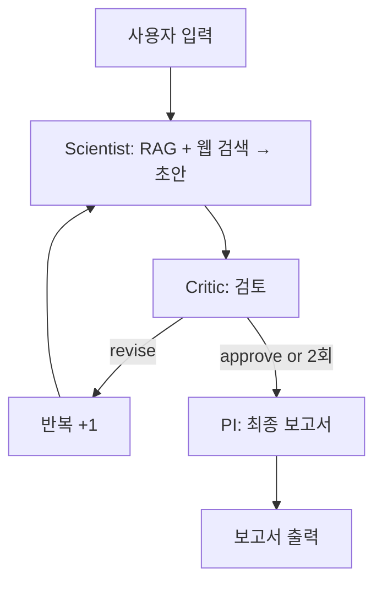

# 🧬 Virtual Lab for NGT Safety Framework

유전자편집식품(NGT) 표준 안전성 평가 프레임워크를 도출하는 AI 에이전트 시스템

## 📋 프로젝트 개요

**목표**: NGT 카테고리 전체에 적용 가능한 표준 안전성 평가 프레임워크를 AI 에이전트 시스템으로 도출

**핵심 아키텍처**: Scientist → Critic → PI (LangGraph Critique Loop)

- **Scientist Agent** (GPT-4o-mini): RAG + 웹 검색을 활용하여 위험 요소 초안 작성
- **Critic Agent** (GPT-4o): 과학적 타당성 및 범용성 검증 (최대 2회 반복)
- **PI Agent** (GPT-4o): 최종 보고서 생성

## 🏗️ 기술 스택

### Backend
- **FastAPI**: REST API + SSE 스트리밍
- **LangGraph**: AI 에이전트 워크플로우 오케스트레이션
- **OpenAI API**: GPT-4o / GPT-4o-mini (직접 호출)
- **Pinecone**: 벡터 DB (규제 문서 316개)
- **Tavily**: 웹 검색 API

### Frontend
- **Next.js 16**: React 19 + TypeScript
- **Tailwind CSS 4**: 다크모드 디자인
- **Server-Sent Events (SSE)**: 실시간 프로세스 타임라인

### Database
- **SQLite**: MVP용 데이터베이스
- **Pinecone Vector DB**: 규제 문서 검색 (RAG)

## 🚀 빠른 시작

### 1. 환경 설정

```bash
# 저장소 클론
git clone https://github.com/baesisi3648/pjt-virtual_lab.git
cd pjt-virtual_lab

# Python 가상 환경 생성 (권장)
python -m venv venv
source venv/bin/activate  # Windows: venv\Scripts\activate

# Python 의존성 설치
pip install -r requirements.txt

# 환경 변수 설정
cp .env.example .env
# .env 파일을 열어 다음을 입력:
# - OPENAI_API_KEY
# - TAVILY_API_KEY
# - PINECONE_API_KEY
```

### 2. 서버 실행

**방법 1: restart_server.bat 사용 (권장)**
```bash
# Windows에서 더블클릭 또는:
./restart_server.bat
```

**방법 2: 수동 실행**
```bash
# 백엔드 서버 (포트 8000)
python -B -m uvicorn server:app --host 0.0.0.0 --port 8000 --reload

# 프론트엔드 (포트 3000) - 새 터미널
cd frontend
npm install  # 최초 1회만
npm run dev
```

### 3. 브라우저 접속

- **Next.js UI**: http://localhost:3000
- **FastAPI Docs**: http://localhost:8000/docs
- **타임라인 데모**: http://localhost:3000/timeline

## 📁 프로젝트 구조

```
pjt-virtual_lab/
├── agents/                 # AI 에이전트 (OpenAI SDK 직접 호출)
│   ├── scientist.py       # Scientist Agent (GPT-4o-mini)
│   ├── critic.py          # Critic Agent (GPT-4o)
│   ├── pi.py              # PI Agent (GPT-4o)
│   └── factory.py         # 동적 전문가 생성
├── workflow/              # LangGraph 워크플로우
│   ├── state.py           # AgentState, CritiqueResult
│   └── graph.py           # StateGraph (Scientist → Critic → PI)
├── tools/                 # LangChain Tools
│   ├── rag_search.py      # Pinecone RAG 검색
│   └── web_search.py      # Tavily 웹 검색
├── rag/                   # RAG 시스템
│   ├── pinecone_client.py # Pinecone 클라이언트
│   ├── embeddings.py      # OpenAI embeddings
│   └── pdf_processor.py   # PDF 청킹
├── frontend/              # Next.js 16 프론트엔드
│   ├── src/
│   │   ├── app/           # App Router
│   │   │   ├── page.tsx   # 메인 페이지
│   │   │   ├── timeline/  # 타임라인 데모
│   │   │   └── report-demo/ # 보고서 에디터
│   │   ├── components/    # React 컴포넌트
│   │   │   ├── ProcessTimeline.tsx  # SSE 스트리밍
│   │   │   └── ReportEditor.tsx     # 보고서 편집
│   │   └── lib/
│   │       └── api.ts     # API 클라이언트
│   └── package.json
├── data/
│   ├── guidelines.py      # 규제 가이드라인
│   └── regulatory/        # 규제 문서 (PDF)
├── tests/                 # 테스트
│   ├── test_agents.py     # 에이전트 단위 테스트
│   ├── test_workflow.py   # 워크플로우 테스트
│   └── test_server.py     # API 테스트
├── scripts/               # 유틸리티 스크립트
│   ├── demos/             # 데모 스크립트
│   ├── verification/      # 검증 스크립트
│   └── load_pdfs_to_pinecone.py
├── docs/                  # 문서
│   ├── completion-reports/  # Phase별 완료 리포트
│   ├── setup/             # 설치 가이드
│   └── ARCHITECTURE_EXPLAINED.md
├── server.py              # FastAPI 서버
├── config.py              # 설정
├── restart_server.bat     # 서버 재시작 스크립트
├── requirements.txt       # Python 의존성
└── TASKS.md               # 개발 태스크 목록

```

## 🔄 워크플로우 흐름



### Critique Loop 규칙

- **최대 2회 반복**: Critic이 계속 `revise` 판정해도 2회 후 강제 종료
- **승인 조건**: 과학적 근거, 범용성, 규제 적정성 모두 4점 이상 (1-5점 척도)

## 🎨 주요 기능

### 1. Live Process Timeline (SSE)
- 에이전트별 실시간 활동 모니터링
- Scientist → Critic → PI 흐름 시각화
- 반복 횟수 및 승인/수정 결정 표시

### 2. Interactive Report Editor
- 마크다운 기반 실시간 편집
- 섹션별 재검토 요청 (AI 재생성)
- 보고서 다운로드 (.md 파일)

### 3. RAG Search (Pinecone)
- 316개 규제 문서 검색
- OpenAI text-embedding-ada-002
- Top-K 유사도 검색

### 4. Web Search (Tavily)
- 최신 논문 및 규제 동향 검색
- .gov, nature.com, sciencedirect.com 우선 검색
- 검색 결과 로깅 (observability)

## 📊 API 엔드포인트

### POST /api/research
워크플로우 동기 실행 (전체 완료 후 응답)

**Request:**
```json
{
  "topic": "유전자편집식품(NGT) 표준 안전성 평가",
  "constraints": "기존 GMO 대비 합리적 완화"
}
```

**Response:**
```json
{
  "report": "# 최종 보고서\n## 1. 개요...",
  "messages": [...],
  "iterations": 2
}
```

### POST /api/research/stream
워크플로우 SSE 스트리밍 (실시간 이벤트 전송)

**Response (SSE):**
```
data: {"type": "start", "message": "연구 프로세스 시작..."}
data: {"type": "agent", "agent": "scientist", "message": "초안 작성 완료"}
data: {"type": "decision", "agent": "critic", "decision": "revise"}
data: {"type": "complete", "report": "...", "iterations": 2}
```

### POST /api/report/regenerate
보고서 섹션 재생성

**Request:**
```json
{
  "section": "공통 위험 식별",
  "feedback": "최신 연구 결과를 추가해주세요",
  "current_report": "..."
}
```

### GET /api/debug/modules
서버 모듈 상태 진단 (디버깅용)

**Response:**
```json
{
  "modules": {
    "scientist": {"has_bind_tools": false, "has_call_gpt4o": true},
    "critic": {"has_bind_tools": false, "has_call_gpt4o": true}
  },
  "llm_test": {"status": "ok", "response": "OK"}
}
```

## 🧪 테스트

```bash
# 전체 테스트 실행
pytest tests/ -v

# 커버리지 포함
pytest tests/ --cov=. --cov-report=html

# 특정 테스트만
pytest tests/test_workflow.py -v
```

## 🛠️ 개발

### 주요 명령어

```bash
# 백엔드 서버 재시작 (권장)
./restart_server.bat

# 프론트엔드 개발 서버
cd frontend && npm run dev

# 전체 테스트
pytest tests/ -v

# Pinecone에 PDF 로드
python scripts/load_pdfs_to_pinecone.py
```

### 코드 품질
- **TAG System**: 모든 파일에 `@TASK`, `@SPEC`, `@TEST` 주석
- **Type Hints**: Python 타입 힌트 + TypeScript
- **TDD**: 테스트 우선 작성

## 💡 문제 해결

### tool_calls 에러가 발생하는 경우
```bash
# 이전 서버 프로세스를 완전히 종료하고 재시작
./restart_server.bat
```

### 프론트엔드가 API를 찾지 못하는 경우
```bash
# 백엔드 서버가 포트 8000에서 실행 중인지 확인
curl http://localhost:8000/health
# 응답: {"status":"ok"}
```

### Pinecone 연결 에러
```bash
# .env 파일에 다음이 설정되어 있는지 확인:
PINECONE_API_KEY=pcsk_...
PINECONE_HOST=https://...
PINECONE_INDEX_NAME=virtual-lab
```

## 📚 참고 문서

- [TASKS.md](./TASKS.md): 개발 태스크 목록
- [docs/setup/SETUP_GUIDE.md](./docs/setup/SETUP_GUIDE.md): 상세 설치 가이드
- [docs/ARCHITECTURE_EXPLAINED.md](./docs/ARCHITECTURE_EXPLAINED.md): 아키텍처 설명
- [docs/completion-reports/](./docs/completion-reports/): Phase별 완료 리포트
- [CLAUDE.md](./CLAUDE.md): 프로젝트 메모

## 💰 비용

OpenAI API 사용료:
- **GPT-4o**: $2.50 / 1M input tokens, $10 / 1M output tokens
- **GPT-4o-mini**: $0.15 / 1M input tokens, $0.60 / 1M output tokens

**예상 비용**: 워크플로우 1회 실행당 약 **$0.05-0.10**

## 🤝 기여

이 프로젝트는 MVP(Minimum Viable Product)입니다.
추가 기능 제안이나 버그 리포트는 Issue를 통해 제출해주세요.

## 📄 라이선스

MIT License

---

**Built with**: FastAPI, LangGraph, Next.js, OpenAI API, Pinecone, Tavily
