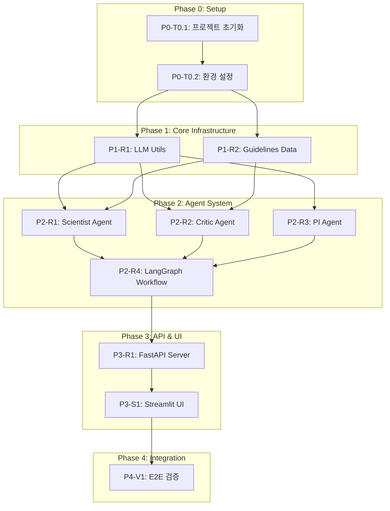

# TASKS.md - Virtual Lab for NGT Safety Framework (MVP)

> **모드**: 문서 기반 (from-docs)
> **소스**: `virtual_lab_mvp.md`, `virtual_lab_script.md`
> **생성일**: 2026-02-08

---

## 프로젝트 요약

| 항목 | 내용 |
|------|------|
| **목표** | 유전자편집식품(NGT) 표준 안전성 평가 프레임워크를 도출하는 AI 에이전트 시스템 |
| **아키텍처** | PI + Critic + Scientist → LangGraph Critique Loop |
| **백엔드** | FastAPI + LangGraph + OpenAI API |
| **프론트엔드** | Streamlit (Chat UI + Report Viewer) |
| **데이터** | Context Injection (RAG 없음, 하드코딩 텍스트) |

---

## 의존성 그래프



---

## Phase 0: 프로젝트 셋업

### [ ] P0-T0.1: 프로젝트 초기화
- **담당**: backend-specialist
- **스펙**: 디렉토리 구조 생성 및 기본 파일 배치
- **산출물**:
  ```
  virtual-lab-mvp/
  ├── app.py                # Streamlit Frontend
  ├── server.py             # FastAPI Backend
  ├── agents/
  │   ├── __init__.py
  │   ├── pi.py
  │   ├── critic.py
  │   └── scientist.py
  ├── workflow/
  │   ├── __init__.py
  │   └── graph.py
  ├── data/
  │   └── guidelines.py
  ├── utils/
  │   └── llm.py
  ├── tests/
  │   ├── __init__.py
  │   ├── test_agents.py
  │   ├── test_workflow.py
  │   └── test_server.py
  ├── .env.example
  └── requirements.txt
  ```

### [ ] P0-T0.2: 환경 설정 및 의존성 관리
- **담당**: backend-specialist
- **스펙**: Python 의존성 정의 및 OpenAI API 키 설정
- **파일**: `requirements.txt`, `.env.example`
- **의존성 목록**:
  - `langchain>=0.3.0`
  - `langgraph>=0.2.0`
  - `langchain-openai>=0.2.0`
  - `fastapi>=0.115.0`
  - `uvicorn>=0.30.0`
  - `streamlit>=1.39.0`
  - `python-dotenv>=1.0.0`
  - `pydantic>=2.0.0`
  - `httpx>=0.27.0` (Streamlit → FastAPI 통신)
  - `pytest>=8.0.0`
  - `pytest-asyncio>=0.24.0`
- **의존**: P0-T0.1

---

## Phase 1: 핵심 인프라

### P1-R1: LLM Utility Resource

#### [ ] P1-R1-T1: OpenAI 모델 초기화 모듈 구현
- **담당**: backend-specialist
- **리소스**: llm
- **파일**: `tests/test_llm.py` → `utils/llm.py`
- **스펙**:
  - `get_gpt4o()`: GPT-4o 인스턴스 반환 (PI, Critic용)
  - `get_gpt4o_mini()`: GPT-4o-mini 인스턴스 반환 (Scientist용)
  - `.env`에서 `OPENAI_API_KEY` 로드
  - temperature, max_tokens 등 기본 파라미터 설정
- **TDD**: RED → GREEN → REFACTOR
- **병렬**: P1-R2-T1과 병렬 가능

---

### P1-R2: Guidelines Data Resource

#### [ ] P1-R2-T1: 규제 가이드라인 텍스트 에셋 구현
- **담당**: backend-specialist
- **리소스**: guidelines
- **파일**: `tests/test_guidelines.py` → `data/guidelines.py`
- **스펙**: System Prompt에 주입될 4개 텍스트 에셋 정의
  1. **RESEARCH_OBJECTIVE**: 연구 목표 정의서
     - "개별 제품이 아닌 카테고리 평가 틀을 만든다"
  2. **CODEX_PRINCIPLES**: 국제 표준 요약 (Codex Alimentarius)
     - 분자적 특성, 독성, 알레르기, 영양성 평가 4대 원칙
  3. **REGULATORY_TRENDS**: 규제 동향 (FDA/EU)
     - Process-based vs Product-based 접근법 차이
  4. **CRITIQUE_RUBRIC**: 비평 기준표
     - 과학적 근거 여부 (1-5점)
     - 범용성 (카테고리 적용 가능성, 1-5점)
     - 과도한 규제 여부 (1-5점)
- **TDD**: RED → GREEN → REFACTOR
- **병렬**: P1-R1-T1과 병렬 가능

---

## Phase 2: 에이전트 시스템

### P2-R1: Scientist (Risk Identifier) Agent

#### [ ] P2-R1-T1: 위험 식별가 에이전트 구현
- **담당**: backend-specialist
- **리소스**: scientist_agent
- **파일**: `tests/test_agents.py::TestScientist` → `agents/scientist.py`
- **스펙**:
  - **모델**: GPT-4o-mini
  - **역할**: NGT 기술의 잠재적 위험 요소 초안 작성
  - **입력**: `AgentState` (topic, constraints, guidelines context, feedback 등)
  - **출력**: 위험 요소 목록 + 필요 자료 목록 (Markdown 형식)
  - **System Prompt 포함**:
    - RESEARCH_OBJECTIVE
    - CODEX_PRINCIPLES
    - REGULATORY_TRENDS
  - **재작성 로직**: feedback이 존재하면 이전 초안 + feedback을 반영한 수정안 생성
- **의존**: P1-R1-T1, P1-R2-T1
- **TDD**: RED → GREEN → REFACTOR
- **병렬**: P2-R2-T1, P2-R3-T1과 병렬 가능

---

### P2-R2: Scientific Critic Agent

#### [ ] P2-R2-T1: 과학 비평가 에이전트 구현
- **담당**: backend-specialist
- **리소스**: critic_agent
- **파일**: `tests/test_agents.py::TestCritic` → `agents/critic.py`
- **스펙**:
  - **모델**: GPT-4o
  - **역할**: Scientist 초안의 과학적 타당성 및 범용성 검증
  - **입력**: `AgentState` (scientist의 초안, iteration count)
  - **출력**: `CritiqueResult`
    - `decision`: "approve" | "revise"
    - `feedback`: 수정 제안 (decision이 "revise"인 경우)
    - `scores`: 3항목 채점 결과
  - **체크리스트 (CRITIQUE_RUBRIC 기반)**:
    1. 과학적 근거가 있는가? (1-5)
    2. 특정 제품이 아닌 카테고리 전체에 적용 가능한가? (1-5)
    3. 불필요하게 과도한 자료를 요구하지 않는가? (1-5)
  - **승인 조건**: 모든 항목 3점 이상
- **의존**: P1-R1-T1, P1-R2-T1
- **TDD**: RED → GREEN → REFACTOR
- **병렬**: P2-R1-T1, P2-R3-T1과 병렬 가능

---

### P2-R3: PI (Principal Investigator) Agent

#### [ ] P2-R3-T1: 연구 책임자 에이전트 구현
- **담당**: backend-specialist
- **리소스**: pi_agent
- **파일**: `tests/test_agents.py::TestPI` → `agents/pi.py`
- **스펙**:
  - **모델**: GPT-4o
  - **역할**: 최종 보고서 작성 및 승인
  - **입력**: `AgentState` (승인된 초안, topic, constraints)
  - **출력**: 최종 Markdown 보고서
  - **보고서 포맷**:
    ```
    # 유전자편집식품 표준 안전성 평가 프레임워크 (Final Report)
    ## 1. 개요 (PI 작성)
    ## 2. 공통 위험 식별 (Scientist 작성 & Critic 검증)
    ## 3. 최소 제출 자료 요건 (필수/조건부/면제)
    ## 4. 결론 및 제언 (PI 작성)
    ```
- **의존**: P1-R1-T1, P1-R2-T1
- **TDD**: RED → GREEN → REFACTOR
- **병렬**: P2-R1-T1, P2-R2-T1과 병렬 가능

---

### P2-R4: LangGraph Workflow

#### [ ] P2-R4-T1: LangGraph StateGraph 워크플로우 구현
- **담당**: backend-specialist
- **리소스**: workflow
- **파일**: `tests/test_workflow.py` → `workflow/graph.py`
- **스펙**:
  - **State 정의** (`AgentState`):
    ```python
    class AgentState(TypedDict):
        topic: str                    # 연구 주제
        constraints: str              # 제약 조건
        draft: str                    # Scientist 초안
        critique: CritiqueResult      # Critic 결과
        iteration: int                # 반복 횟수 (max 2)
        final_report: str             # PI 최종 보고서
        messages: list[dict]          # 회의 로그 (UI 표시용)
    ```
  - **노드 구성**:
    - `drafting`: Scientist 에이전트 호출 → 초안 작성
    - `critique`: Critic 에이전트 호출 → 검토
    - `finalizing`: PI 에이전트 호출 → 최종 보고서
  - **엣지 로직**:
    - `critique` → `drafting`: feedback 존재 & iteration < 2
    - `critique` → `finalizing`: approve 또는 iteration >= 2
  - **회의 로그**: 각 노드 실행 시 messages에 에이전트 발언 추가
    - `[시스템]` 상태 메시지
    - `[에이전트명]` 에이전트 발언
- **의존**: P2-R1-T1, P2-R2-T1, P2-R3-T1
- **TDD**: RED → GREEN → REFACTOR

---

## Phase 3: API & UI

### P3-R1: FastAPI Server Resource

#### [ ] P3-R1-T1: FastAPI 서버 구현
- **담당**: backend-specialist
- **리소스**: api_server
- **엔드포인트**:
  - `POST /api/research` - 워크플로우 실행
    - Request: `{ "topic": str, "constraints": str }`
    - Response: `{ "report": str, "messages": list[dict], "iterations": int }`
  - `POST /api/research/stream` - SSE 스트리밍 (회의 로그 실시간)
    - Request: `{ "topic": str, "constraints": str }`
    - Response: Server-Sent Events (각 에이전트 발언을 실시간 전송)
  - `GET /health` - 헬스체크
- **파일**: `tests/test_server.py` → `server.py`
- **스펙**:
  - CORS 미들웨어 (Streamlit 연동)
  - LangGraph workflow 호출 및 결과 반환
  - SSE 스트리밍으로 회의 로그 실시간 전달
- **의존**: P2-R4-T1
- **TDD**: RED → GREEN → REFACTOR

---

### P3-S1: Streamlit 메인 화면

#### [ ] P3-S1-T1: Streamlit Chat UI 구현
- **담당**: frontend-specialist
- **화면**: Streamlit 메인 페이지
- **레이아웃**: 2-Column (왼쪽: 채팅, 오른쪽: 보고서)
- **컴포넌트**:
  - **InputForm**: 연구 주제 + 제약 조건 입력 폼
  - **ChatLog**: 에이전트 회의 로그 (실시간 스트리밍)
    - 시스템 메시지: 회색 배경
    - Scientist 발언: 파란색 아이콘
    - Critic 발언: 빨간색 아이콘
    - PI 발언: 초록색 아이콘
  - **ReportViewer**: 최종 Markdown 보고서 렌더링
  - **ProgressIndicator**: 현재 단계 표시 (Drafting → Critique → Finalizing)
- **데이터 요구**: api_server (POST /api/research/stream)
- **파일**: `app.py`
- **스펙**:
  - `st.columns([1, 1])` 으로 2분할 레이아웃
  - SSE로 회의 로그 실시간 수신 및 표시
  - 보고서 완료 시 오른쪽 패널에 Markdown 렌더링
  - 보고서 다운로드 버튼 (`.md` 파일)
- **의존**: P3-R1-T1
- **데모 상태**: loading(스피너), streaming(로그 수신 중), complete(보고서 표시), error(에러 표시)

#### [ ] P3-S1-T2: Streamlit UI 통합 테스트
- **담당**: test-specialist
- **화면**: Streamlit 메인 페이지
- **시나리오**:
  | 이름 | When | Then |
  |------|------|------|
  | 주제 입력 및 실행 | 주제 입력 후 실행 버튼 클릭 | 회의 로그 실시간 표시 |
  | 회의 진행 표시 | 워크플로우 실행 중 | 각 에이전트 발언 순차 표시 |
  | 보고서 생성 | 워크플로우 완료 | 오른쪽 패널에 보고서 표시 |
  | 보고서 다운로드 | 다운로드 버튼 클릭 | .md 파일 다운로드 |
  | 에러 처리 | API 호출 실패 | 에러 메시지 표시 |
- **파일**: `tests/test_app.py`

#### [ ] P3-S1-V: 연결점 검증
- **담당**: test-specialist
- **화면**: Streamlit 메인 페이지
- **검증 항목**:
  - [ ] Endpoint: POST /api/research/stream 응답 정상
  - [ ] Streaming: SSE 이벤트 수신 확인
  - [ ] Report Render: Markdown 보고서 정상 렌더링
  - [ ] State Flow: Drafting → Critique → Loop(0~2회) → Finalizing 순서
  - [ ] Agent Messages: 3개 에이전트 발언 모두 포함
  - [ ] Download: .md 파일 다운로드 동작

---

## Phase 4: 통합 검증

#### [ ] P4-V1: E2E 통합 검증
- **담당**: test-specialist
- **스펙**: 전체 시스템 End-to-End 동작 검증
- **검증 항목**:
  - [ ] FastAPI 서버 기동 → Streamlit 앱 기동
  - [ ] 사용자 입력 → LangGraph 워크플로우 실행
  - [ ] Scientist 초안 → Critic 검토 → 조건부 루프 (최대 2회)
  - [ ] PI 최종 보고서 생성
  - [ ] 보고서 포맷: 4개 섹션 (개요/위험 식별/최소 자료 요건/결론)
  - [ ] 스크립트 시나리오 재현: Over-regulation 지적 → 수정 → 승인 흐름
- **의존**: P3-S1-T1, P3-S1-T2, P3-S1-V
- **파일**: `tests/test_e2e.py`

---

## 병렬 실행 매트릭스

| Phase | 태스크 그룹 | 병렬 가능 태스크 | 조건 |
|-------|------------|-----------------|------|
| P0 | Setup | P0-T0.1 → P0-T0.2 | 순차 |
| P1 | Infrastructure | P1-R1-T1, P1-R2-T1 | 병렬 가능 |
| P2 | Agents | P2-R1-T1, P2-R2-T1, P2-R3-T1 | 병렬 가능 |
| P2 | Workflow | P2-R4-T1 | 에이전트 3개 완료 후 |
| P3 | Server | P3-R1-T1 | Workflow 완료 후 |
| P3 | UI | P3-S1-T1 → P3-S1-T2 → P3-S1-V | 순차 (Server 완료 후) |
| P4 | Verification | P4-V1 | 모든 P3 완료 후 |

---

## 실행 순서 요약

```
P0-T0.1 → P0-T0.2
    ↓
P1-R1-T1 ←──┐
             ├── 병렬
P1-R2-T1 ←──┘
    ↓
P2-R1-T1 ←──┐
P2-R2-T1 ←──┤── 병렬
P2-R3-T1 ←──┘
    ↓
P2-R4-T1 (Workflow: 에이전트 통합)
    ↓
P3-R1-T1 (FastAPI Server)
    ↓
P3-S1-T1 → P3-S1-T2 → P3-S1-V (Streamlit UI)
    ↓
P4-V1 (E2E 검증)
```

---

## 태스크 총계

| Phase | 태스크 수 | 유형 |
|-------|----------|------|
| P0 | 2 | Setup |
| P1 | 2 | Resource (인프라) |
| P2 | 4 | Resource (에이전트 + 워크플로우) |
| P3 | 4 | Resource 1 + Screen 3 (서버 + UI) |
| P4 | 1 | Verification |
| **합계** | **13** | |
